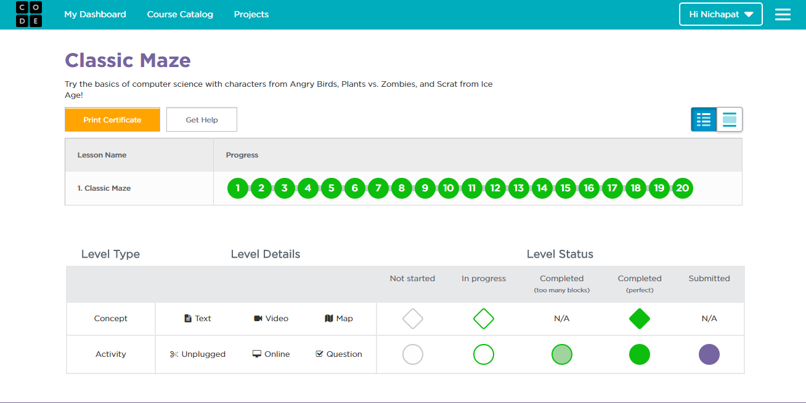
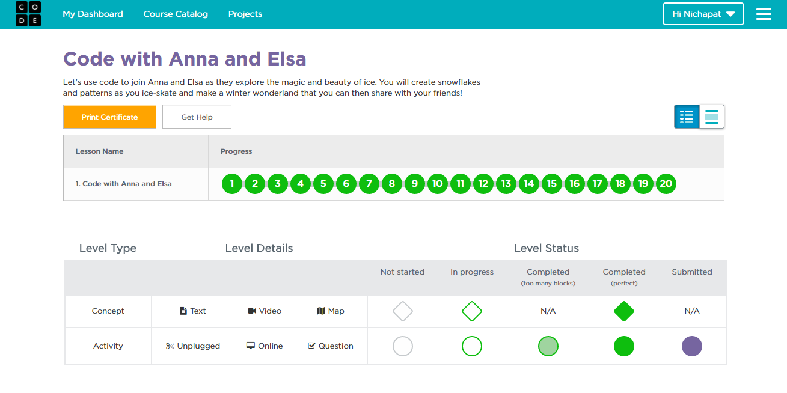
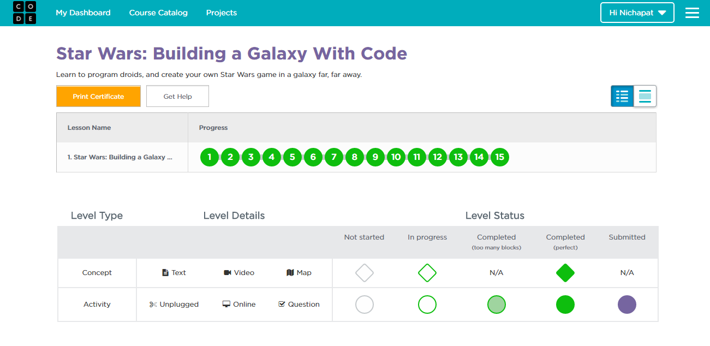
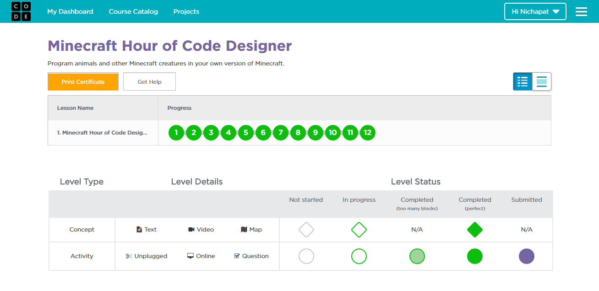

# tp_prog_week3
งานครั้งที่ 4 วิชาการเขียนโปรแกรมคอมพิวเตอร์ ปวส1

## วิธีการส่งงาน

1.  บันทึกหน้า dashboard ของแต่ละกิจกรรม
2.  **ตั้งชื่อตามนี้**
    -  Angry Bird เป็น lab1.png
    -  Frozen เป็น lab2.png
    -  Star wars เป็น lab3.png
    -  Minecraft เป็น lab4.png
3.  อัพทั้ง 4 รูปไว้ใน folder img (เมื่อสำเร็จไฟล์จะมีภาพปรากฎ)
4.  เขียนสรุปสิ่งที่ได้ด้วย

------------------------------------------

## กิจกรรมทดลอง Angry bird

### ภาพยืนยันความสมบูรณ์ (3 points)

### สรุปสิ่งที่ได้เรียนรู้จากกิจกรรม (2 points)

$$$$1

ได้เรียนรูคำสั่งให้ตัว  Angry bird สามารถทำตามคำสั่งเราที่ได้ใส่โค้ดเข้าไป ซึ่งในเกมส์จะมีโค้ดให้เราเลือกเพื่อให้ตัว Angry bird ไปหาหมู โดยจะมีคำสั่ง เดินไปข้างหน้า เลี้ยวซ้ายขวา และยังมีคำสั่งให้ทำซ้ำ

1$$$$

-------------------------------------------

## กิจกรรมทดลอง Frozen

### ภาพยืนยันความสมบูรณ์ (3 points)

### สรุปสิ่งที่ได้เรียนรู้จากกิจกรรม (2 points)

$$$$2

เป็นการเขียนคำสั่งให้ Elsa เดินวาดรูปบนน้ำแข็ง ซึ่งจะมีคำสั่งให้เดิน เลี้ยวซ้ายขาว องศาให้เลี้ยว มีให้ทำซ้ำ จำนวนที่ต้องการวาด และคำสั่งให้วาดรูปลายเส้นที่เลือก

2$$$$

------------------------------------------

## กิจกรรมทดลอง Star wars

### ภาพยืนยันความสมบูรณ์ (3 points)

### สรุปสิ่งที่ได้เรียนรู้จากกิจกรรม (2 points)

$$$$3

เป็นการเขียนคำสั่งให้ หุ่นยตนต์ ซึ่งจะมีคำสั่งให้เดิน เลี้ยวซ้ายขวา สร้างตัวละครขึ้นมา มีการเก็บคะแนนจากตัวละครที่สัมผัสและลดคะแนนเมื่อโดนสัมผัส และมีการเพิ่มจำนวนตัวละครเมื่อสัมผัส

3$$$$

-------------------------------------------

## กิจกรรมทดลอง Minecraft

### ภาพยืนยันความสมบูรณ์ (3 points)

### สรุปสิ่งที่ได้เรียนรู้จากกิจกรรม (2 points)

$$$$4

เป็นการเขียนคำสั่งให้ สัตว์ ตัวละคร ซึ่งจะมีคำสั่งให้เดิน เลี้ยวซ้ายขวา โดยสัตว์ต่างๆที่เราสร้างขึ้นจะทำตามคำสั่งที่เราเขียน ซึ่งเมื่อเราสัมผัสก็จะมี่เห็นการณ์ต่างที่เรากำหนด และมีการให้คะแนน

4$$$$

-------------------------------------------

## สรุปคะแนน

| Topic          | Score           |
| :------------- | :-------------: |
| Angry Bird 1   |                 |
| Angry Bird 2   |                 |
| Frozen 1       |                 |
| Frozen 2       |                 |
| Star wars 1    |                 |
| Star wars 2    |                 |
| Minecraft 1    |                 |
| Minecraft 2    |                 |

**รวม :** 0 คะแนน
